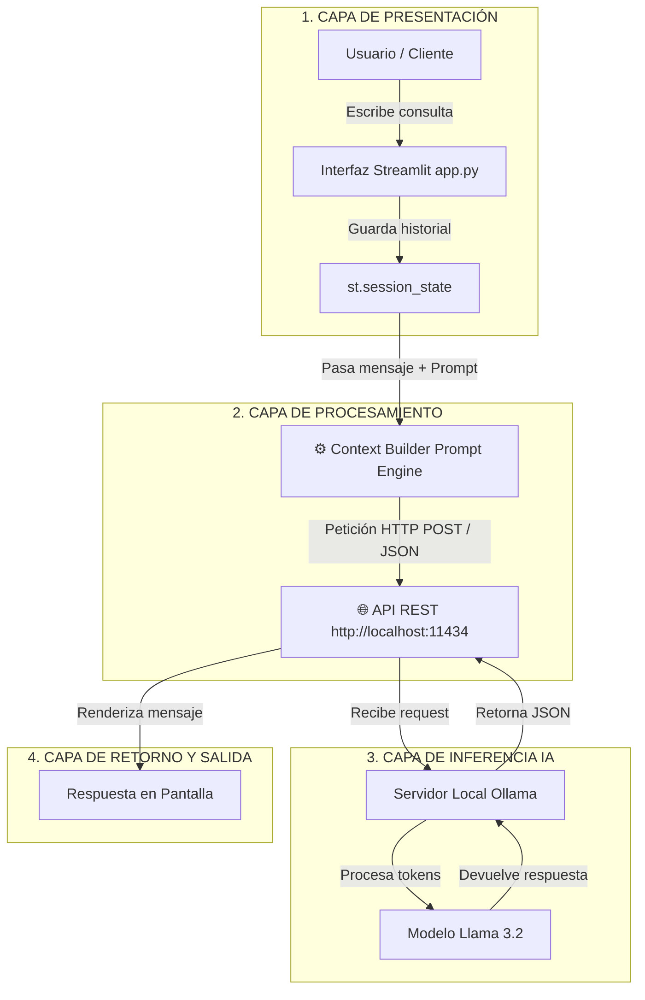

# Chat Bot Parrillero

Aplicación de Streamlit para recomendar el término ideal de cocción de carne según el corte solicitado.

## Requisitos

- Python 3.10+
- Ollama ejecutándose localmente
- Modelo `llama3.2:1b`

## Instalación

```bash
python -m venv .venv
source .venv/bin/activate  # Linux/macOS
# En Windows: .venv\Scripts\activate
pip install -r requirements.txt
```

## Ejecutar la app

```bash
streamlit run app.py
```

## Importante

La app envía peticiones a `http://localhost:11434/api/chat`, por lo que debes tener Ollama corriendo en tu equipo.

## Descripción

El chatbot responde con recomendaciones de cocción para cortes de carne, explica por qué se recomienda cada término y puede sugerir acompañamientos.
